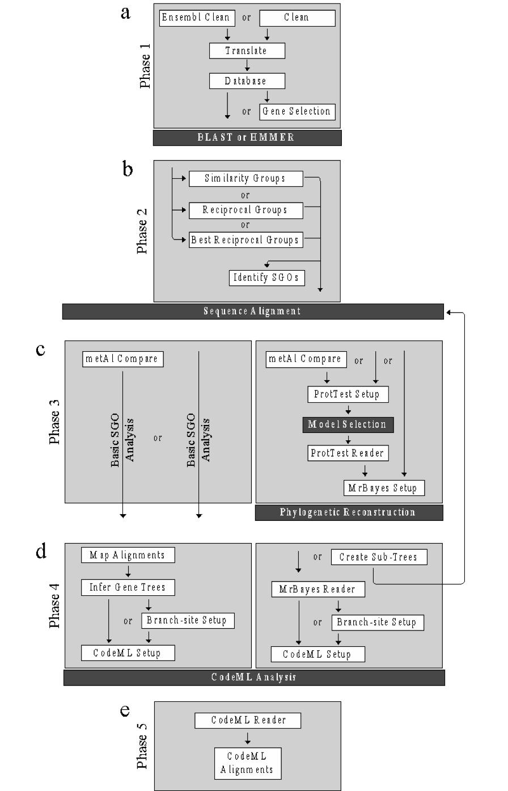

*********************
Introduction to VESPA
*********************

The VESPA (Very large-scale Evolution and Selective Pressure analyses) toolkit is a collection of commands designed to simplify molecular evolutionary analyses. The major motivation behind the development of VESPA was minimizing potential sources of error in large-scale selective pressure analyses using codeML from the PAML package [Yang 2007].

Assessing selective pressure variation on a large scale using protein coding DNA sequences requires a complex pipeline composed of numerous independent analyses, including: ortholog identification, multiple sequence alignment, phylogenetic reconstruction, and assessment of codon-based models of evolution. The pipeline requires multiple data manipulation steps to combine the output of each of these different stages (such as parsing BLAST result files to identify homologs and assessment of the suitability of the phylogenetic tree for selective pressure analysis). For researchers new to bioinformatics, manual data manipulation is prone to error, is potentially unstandardized, and is difficult to reproduce. VESPA eliminates the need for manual data manipulation by creating functions that automatically complete the majority of data manipulation steps using a standardized approach. In addition, the use of VESPA should minimize the requirements for users to create their own programs.

While the procedures within each stage of a selective pressure analysis are independent, there are requirements on the order in which the phases are carried out. VESPA creates a standardize pipeline of analyses with a specific ordering of phases in the process. In addition, the package encompasses multiple specialized pipelines to accurately assess selective pressure and reduce potential false positives (such as those caused by alignment error [Fletcher and Yang, 2010]).

Lastly, VESPA was designed to increase user productivity by automating labor intensive or highly repetitive tasks: *i)* automation by recursion – used to repeat an analysis on a number of files  (e.g. cleaning and translating a directory of genomes), and *ii)* automation of analysis methods – used to complete tasks that are normally demanding but invariable in execution (e.g. identifying homologs within BLAST output data). Automating these procedures within VESPA has created an analysis package that is highly scalable (*i.e.* from single gene to whole genome analyses) and that flexible enough to be useful for many levels of expertise and many alternative purposes/endpoints.

Phase and pipeline structure
============================

The VESPA toolkit is separated into five separate analysis phases. The rationale behind the 'phase' system was primarily to aid users in understanding the distinct procedures involved in selective pressure analysis and to provide more advanced users with a flexible and adaptable pipeline. Functions within a phase also analyze the same input type (e.g. sequences, BLAST output, etc.).

The output of each phase in the VESPA toolit requires an analysis step that must be completed by the user with third-party software. These analyses are not automated by VESPA for three reasons: i) these analyses are far too computationally intensive, and ii) the submission process for these programs may differ from user to user, and iii) software updates may create bugs within the pipeline.

The software package also incorporates two analysis pipelines, a basic pipeline for single gene orthologs (SGOs) and an advanced pipeline for both SGOs and multi-gene families (MGFs). The basic pipeline was designed to bypass the phylogenetic reconstruction techniques (phase 3) by inferring a gene phylogeny from a user-defined species phylogeny. Usage of the basic pipeline is only recommended if the genes are confirmed SGOs.

**VESPA command overview**

.. _img_overview:

.. note::
	Each phase indicates the functions (white boxes) and the order in which they are invoked. Optional functions are indicated by ‘or’ and may be skipped. Dark boxes indicate third-party programs. (a) Phase 1 (Section 1.6) is the data preparation phase and includes the functions: ensembl_clean/clean (Section 1.6.1), translate (Section 1.6.2), create_database (Section 1.6.3), and gene_selection (Section 1.6.4). This phase ends with the requirements for sequence similarity searching. (b) Phase 2 (Section 1.7) is the similarity group creation phase and includes the following functions: similarity_groups (Section 1.7.2), reciprocal_groups (Section 1.7.2) and best_reciprocal_groups (Section 1.7.3). This phase results in the creation of requirements for multiple sequence alignment (MSA). (c) Phase three (Section 1.8) is the alignment assessment stage and includes both a basic pipeline (on the left) for MSA files that contain only single gene orthologous (SGOs) and an advanced pipeline (on the right) for unconfirmed MSA files. The phase includes the following functions: metal_compare (Section 1.8.1), protest_setup (Section 1.8.2), protest_reader (Section 1.8.2), and mrbayes_setup (Section 1.8.3). This phase results in either: i) a phylogenetic trees of the MSAs for the advanced pipeline or ii) selected MSAs for the basic pipeline. (d) Phase four (Section 1.9) is the selective pressure phase and continues the basic pipeline and advanced pipeline of the previous phase. The phase four basic pipeline includes: map_alignment (Section 1.9.1), infer_genetree (Section 1.9.2), setup_codeml (Section 1.9.3), and create_branch (Section 1.9.6). The phase four advanced pipeline includes: mrbayes_reader (Section 1.9.4), create_subtrees (Section 1.9.5), create_branch (Section 1.9.6), and setup_codeml (Section 1.9.3). This phase results in the input requirements for selective pressure analysis by codeML. (e) The final phase (Section 1.10) includes the function codeml_reader (Section 1.10.1) that analyzes the results of the codeML analysis.

Command structure
=================

The VESPA software package was written in python (v2.7) and requires a UNIX environment to operate. VESPA may be invoked as follows: 
usr$ python vespa.py
The VESPA help screen will then be displayed by default. If desired, the help screen may also be displayed using the following commands.
usr$ python vespa.py help
usr$ python vespa.py h
In addition to the basic help screen, VESPA has the option to display basic help information for each VESPA command. If desired, the help information may be displayed by specifying the command of interest subsequent to the help screen call (please note the space):
usr$ python vespa.py help translate
Commands in VESPA are specified after the program call (i.e. python vespa.py) on the UNIX command-line. Please note a space is required between the program call and the desired command. For example, the translate command would be invoked as shown below:
usr$ python vespa.py translate
Commands also require specific options to be invoked to function correctly. Options are specified after the command and begin with a dash symbol (-) and end with an equal sign (=) followed by either a user-specified file or Boolean value (i.e. True/False). For example, the translate command requires the user to specify the input (here “user_data.txt”) as follows:
usr$ python vespa.py translate -input=user_data.txt
Please note the space between the command and option, it should also be noted that there is no space separating the option (i.e. “-input=”) and the user-specification (i.e. “user_data.txt”). Multiple options may be invoked on the same command-line as shown below and are separated by a space:
usr$ python vespa.py translate -input=user_data.txt -cleave_terminal=False
A comprehensive list of the commands supported in VESPA may be found on Pg. 10 of this manual. 

Basic and required options
==========================

Commands in VESPA (see this manual Pg. 10) use two categories of options: basic and command-specific. Basic options may be invoked alongside any command, whereas command-specific options are limited to particular commands. This version of VESPA incorporates two basic options: ‘input’ and ‘output’. 
The ‘input’ option: This option is invoked by the user to indicate the desired input file or directory for a command. As indicated, this option is designed to function with either: i) an individual file or ii) a directory housing multiple files. Please note that the ‘input’ option is a REQUIRED option and therefore is required by all commands to function. Not specifying the input option will result in VESPA printing a warning message. Please note that ‘USR_INPUT’ is a placeholder for the input defined by the user. 
usr$ python vespa.py temp_command -input=USR_INPUT
For example, if a user wanted to analyze the directory “Genomes” they would type:
usr$ python vespa.py temp_command -input=Genomes
The ‘output option: This option indicates the desired name the user supplies for the output of a command. Depending on the input used, the option will either specify: i) the output filename (if an individual file was the input), or ii) the output directory name (if a directory was the input). It should be noted that some commands have specialized output, in these cases the desired name will be applied where possible. 
usr$ python vespa.py command -input=USR_INPUT –output=USR_DEF

VESPA commands
==============

+-----------------------+--------------------------+------------------+------------------+----------------+
| Phase one             | Phase two                | Phase three      | Phase four       | Phase five     |
+=======================+==========================+==================+==================+================+
| clean                 | similarity_groups        | metal_compare    | map_alignments   | codeml_reader  |
+-----------------------+--------------------------+------------------+------------------+----------------+
| clean_ensembl         | reciprocal_groups        | prottest_setup   | infer_genetree   |                |
+-----------------------+--------------------------+------------------+------------------+----------------+
| rev_complement        | best_reciprocal_groups   | prottest_reader  | mrbayes_reader   |                |
+-----------------------+--------------------------+------------------+------------------+----------------+
| translate             |                          | mrbayes_setup    | codeml_setup     |                |
+-----------------------+--------------------------+------------------+------------------+----------------+
| create_database       |                          |                  | create_subtrees  |                |
+-----------------------+--------------------------+------------------+------------------+----------------+
| gene_selection        |                          |                  | create_branch    |                |
+-----------------------+--------------------------+------------------+------------------+----------------+
| individual_sequences  |                          |                  |                  |                |
+-----------------------+--------------------------+------------------+------------------+----------------+
| split_sequences       |                          |                  |                  |                |
+-----------------------+--------------------------+------------------+------------------+----------------+