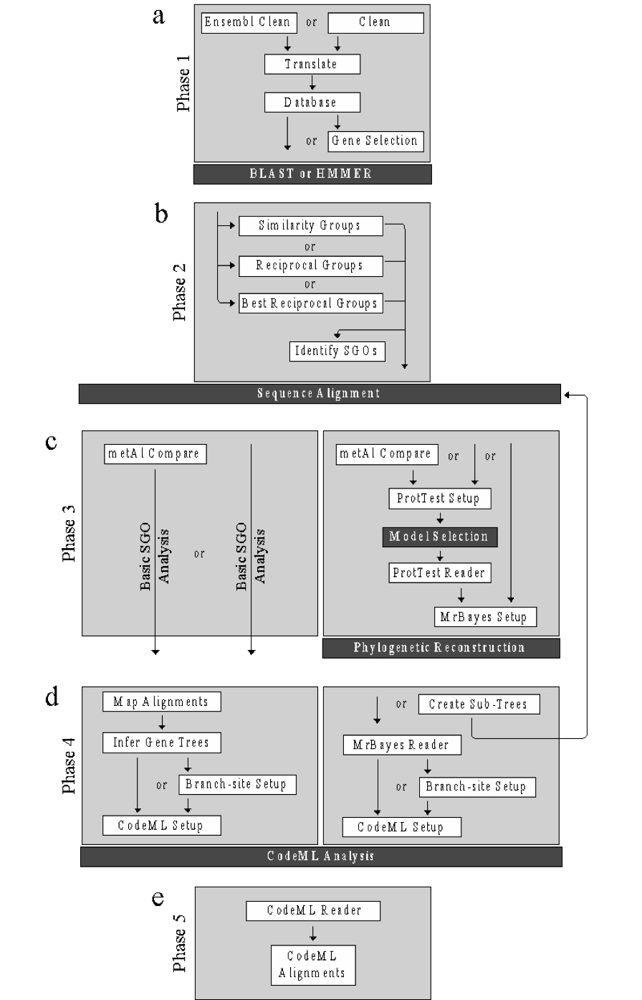

*************************
Phase 1: data preparation
*************************

The data preparation phase was included for users new to bioinformatics. The phase prepares downloaded genomes for homology searching using the two VESPA supported homology search tools: BLAST [Altschul et al., 1990] and HMMER [Eddy, 1998]. This phase also includes supplementary functions not required for either pipeline shown in :numref:`fig_overview` but rather to aid users in homology searching.

:code:`clean` and :code:`clean_ensembl` functions
=================================================

The VESPA toolkit incorporates two quality control functions: :code:`clean` and :code:`clean_ensembl`.

:code:`clean`
-------------

This basic function was designed as a QC filter for downloaded nucleotide sequences and/or genomes (:numref:`fig_overview`\a). Each sequence is confirmed as protein coding by using a conditional statement to verify that the nucleotide sequence contains only complete codons (i.e. the length of the sequence is exactly divisible by 3) (:numref:`fig_overview`\b). This is an essential step to confirm gene annotation quality and permit the codon substitution models of codeML [Yang, 2007]. Only sequences that pass QC are retained for further analysis (:numref:`fig_overview`\c).
::

    $ python vespa.py clean –input=<user_input>

:code:`clean_ensembl`
---------------------

This more advanced function was designed to identify the longest nucleotide (canonical) transcript within an Ensembl nucleotide genome that passed the QC step detailed in the :code:`clean` function. This is achieved by exploiting the pattern of ensembl sequence identifiers, which consistently begin with the gene identifier followed by the transcript identifier (:numref:`fig_overview`\d). The longest transcript is then identified for each ensembl gene identifier and saved within the output file.
::

    $ python vespa.py clean_ensembl –input=<user_input>

.. note::

    Supported file format(s): :code:`-input`: fasta formatted files

Command-specific options: Both clean functions incorporate a single enabled option (:code:`rm_internal_stop`) and two disabled options (:code:`label_filename` and :code:`infer_ensembl_species`) that may be manually configured by the user. The option :code:`rm_internal_stop` will remove sequences if they contain an internal stop codon (:numref:`fig_overview`\g), those removed will be reported in the command log file. It should be noted that while :code:`rm_internal_stop` is configurable, codeML does not permit nonsense mutations and this option should be enabled if the toolkit is being used for that purpose. The options :code:`label_filename` and :code:`infer_ensembl_species` alter sequence headers (i.e. Ensembl gene and transcript identifiers) by adding an additional identifier at the beginning of the header: :code:`infer_ensembl_species` adds the common species name of the respective Ensembl identifier (:numref:`fig_overview`\e) and :code:`label_filename` adds the filename (without the file extension) (:numref:`fig_overview`\f). It should be noted that executing a labeling option is required for enabling VESPA to automate the creation of gene trees and setup of the codeML branch-site models (for details see Section 1.9.6). 
::

    $ python vespa.py clean –input=USR_INPUT -rm_internal_stop=False
    $ python vespa.py clean –input=USR_INPUT -label_filename=True
    $ python vespa.py clean –input=USR_INPUT -infer_ensembl_species=True

**Overview of :code:`clean` and :code:`clean_ensembl` functions**

.. _fig_overview:

    FastA formatted files are shown as grey boxes and the associated white boxes show the filename. Data confirmation steps shown as readout beneath each example indicates if the results passed the check. The following QC checks are illustrated here: (a) Cleaning an input file, (b) initiates with codon confirmation, (c) only sequences that pass are saved in the output. If the :code:`ensembl_clean` function is invoked, in addition to codon confirmation, each transcript of an ensembl gene undergoes (d) a longest transcript confirmation and only the longest transcript is saved in the output. Two options are available to append a prefix to sequence headers: (e) :code:`infer_ensembl_species` to append the Ensembl genome, or (f) :code:`label_filename` to append the input filename. Invoking (g) :code:`rm_internal_stop` will remove genes that fail stop codon confirmation.

:code:`translate`
=================

The :code:`translate` function translates nucleotide sequences that passed the QC filter of either clean function into amino acid sequences in the first reading frame forward only (:numref:`fig_translate`\a). The function operates by splitting the nucleotide sequence into codons and then translating them into their respective amino acids (:numref:`fig_translate`\b). Translation is a mandatory step to produce alignments permitted by the codon substitution models of codeML (see Section 1.9.1) [Yang, 2007]. The resulting protein sequences are then saved (:numref:`fig_translate`\c). If non-coding sequences (incomplete codons or internal stop codons) were not removed prior to invoking :code:`translate`, the function will produce a warning message. The warning reports that the function is designed to only translate protein-coding sequences and terminates the function. 
usr$ python vespa.py translate  –input=USR_INPUT
Command-specific options: :code:`translate` incorporates a single unique option :code:`cleave_terminal` and the previously described options of the clean functions (Section 1.6.1). The :code:`cleave_terminal` option is enabled by default and is designed to cleave the terminal stop codon of each sequence (:numref:`fig_translate`\d). The function and default status of the remaining options are detailed in Section 1.6.1.
::

    $ python vespa.py translate –input=USR_INPUT -cleave_terminal=False

.. note::

    Supported file format(s): :code:`input`: fasta formatted files

**Overview of** :code:`translate`

.. _fig_translate:

    Fasta formatted files are shown as grey boxes and their filenames are given in white boxes. (a) Translating an input file using :code:`translate` initiates the translation procedure by separating the sequence (as in (b)) into each codon to determine the respective amino acid, (c) translated sequences are saved in the :code:`Translated` output file. (d) If the :code:`cleave_terminal` option is invoked, terminal stop codons will be removed from each applicable sequence.

**Editing gene headers**

To keep the headers uniform throughout the process, edit the nucleotide versions of the sequence files after the :code:`clean` or :code:`ensembl_clean` step but before the 'translate' step.
::

    # Ensembl genomes have the headers in the format
    >ENS(3 sp specific characters)G(11 digit gene ID)|ENS(3 sp specific characters)T(for transcript)(11 digit trans riot ID which may or may not be identical to gene ID). For eg
    >ENSMODG00000000014|ENSMODT00000000012

    # Need to insert the species common name immediately after the > sign. So use sed command
    sed 's/>/>(species common name|/g` input filename > output filename

    # For Ensembl genomes, I used 
    sed 's/>/>Opossum|/g` Translated_Ensembl_Cleaned_Genomes/Cleaned_Opossum.txt > Opossum_edit.txt

    # To shorten the Ensembl headers to 30 characters or less (necessary later at the CodeML step) - remove the transcript ID from the gene headers - do this only after the :code:`clean` or :code:`ensembl_clean` step!!

    sed -ic '/|ENS/s/...................$//` INPUT FILE (Ensembl genome)

    # Finds the pattern |ENS, and in that line, substitutes the last 19 characters (can change the number of characters here if needed) with nothing. -ic means it modifies the files and makes a backup copy of the original file. 

    # NCBI genomes are more complex. They have very long gene headers, for example
    >XM_007934499.1 PREDICTED: Orycteropus afer afer serum deprivation response (SDPR), mRNA

    # Need to insert the species common name after the > sign - same as for ensembl genome. But also need to truncate the header after the XM id, i.e., after the first white space. So use “.*” which is the wildcard after a space, and say substitute everything that comes after a space to nothing. s/ .*//g
    sed 's/>/>Tenrec|/g; s/ .*//g` Cleaned_Tenrec.fa > Tenrec_edit.txt

:code:`create_database`
=======================

The :code:`create_database` function was designed for users to concatenate multiple genomes into the single database required for homology searching. The function operates by building the database a single sequence at a time (:numref:`fig_create_database`\a and :numref:`fig_create_database`\b). The command-line version of BLAST requires additional commands to create a BLAST-formatted database. If the user enables the option :code:`format_blast` and BLAST is installed on the system the function will attempt to automate the additional steps required for producing a BLAST-ready database (:numref:`fig_create_database`\c). If :code:`create_database` is unable to create the BLAST-formatted database, a warning message will be produced (see Section 1.12 BLAST version requirements).
::

    usr$ python vespa.py create_database –input=USR_INPUT

.. note::

    Supported file format(s): :code:`input`: fasta formatted files

::

    # To set up the directory structure for the BLAST database
    mkdir BlastdbAfr
    cp database.fas BlastdbAfr
    cd BlastdbAfr
    makeblastdb -in database.fas -dbtype prot

    BLAST script (from Ali)
    emacs BlastAfr_sge.sh

    SAMPLES=*.txt
    COMMANDS=()
    for S in $SAMPLES;
    do COMMANDS+=("blastp -db BlastdbAfr/database_Afrotheria.fas -query $S -out $S.out -outfmt 6 -evalue 0.0000001 -seg yes -soft_maskin\                       
    g true -max_target_seqs 5000 2> blast_job.${SGE_TASK_ID}.std.err 1> blast_job.${SGE_TASK_ID}.std.out");
    done

    #$ -cwd
    #$ -V
    #$ -l h_rt=24:00:00
    #$ -l h_vmem=6G
    #$ -t 1-10
    #$ -tc 10
    #$ -m be
    #$ -M fbsisi@leeds.ac.uk
    #$ -o blast_job.out
    #$ -e blast_job.std.err

    module load blast/2.5.0+
    eval ${COMMANDS[$SGE_TASK_ID-1]}
    module unload blast/2.5.0+

**Overview of** :code:`create_database`

.. _fig_create_database:

    Fasta formatted files are shown as grey boxes and their filenames in white boxes. Invoking the :code:`create_database` function (a) combines numerous sequence files into (b) a single sequence database file. (c) Shows the :code:`format_blast` option that will generate the required database files for BLAST [Altschul et al., 1990].

:code:`gene_selection`
======================

If the user is only interested in a subset of genes, the :code:`gene_selection` function was designed to enable the user to search a database for gene identifiers specified in a separate file. The function operates by searching the sequence headers of the database for matches with the user specified gene identifiers (Figure 5a). The matching process only requires the user-specified identifiers to match a portion of the database sequence headers (Figure 5b). The function saves a single sequence file for each matched identifier (Figure 5c). If a user-specified identifier matches more than a single sequence header in the database, or indeed no sequence in the database, the function will produce a warning message. It should be noted that the :code:`gene_selection` function requires the option :code:`selection_csv` to operate.
::

    $ python vespa.py gene_selection –input=USR_INPUT -selection_csv=USR_INPUT

.. note::

    Supported file format(s): :code:`input`: fasta formatted files; :code:`selection_csv`: csv, tsv, and unformatted.

**Overview of** :code:`gene_selection` **function**

.. _fig_gene_selection:

    FastA formatted files are shown as grey boxes and their filenames in white boxes. Data confirmation steps indicate if the results passed the check. (a) The :code:`gene_selection` function requires two files to operate: a database (Human.fasta) and a user specified gene identifiers file (genes.csv). (b) The function operates using header confirmation to identify sequences in the database that match to those specified by the user. (c) The output of the function is a single sequence file for each user specified genes found. 

Supplementary functions
=======================

The VESPA toolkit also incorporates three supplementary functions that were designed to aid users in potential data manipulations required for homology searching: :code:`rev_complement`, :code:`individual_sequences`, and :code:`split_sequences`.
The :code:`rev_complement` function: This function was designed for users to return the reverse complement of nucleotide sequences. Depending on the desired use, it is recommended that the user run the QC filter of the clean functions either preceding or proceeding the :code:`rev_complement` function.
::

    $ python vespa.py rev_complement –input=USR_INPUT

.. note::

    Supported file format(s): :code:`input`: fasta formatted files

Command-specific options: The :code:`rev_complement` function incorporates the two labeling options of the clean functions (previously described in Section 1.6.1). It should be noted that the option :code:`rm_internal_stop` was not included in this function.

The :code:`individual_sequences` function: This function was designed for users to separate files/directories housing large collections of sequences (i.e. genome file(s) and database files) into individual sequence files.
::

    $ python vespa.py individual_sequences –input=USR_INPUT

.. note::

    Supported file format(s): :code:`input`: fasta formatted files

The :code:`split_sequences` function: This function was designed for users to separate files/ directories housing large collections of sequences (i.e. genome file(s) and database files) into sequence files that house a specified number of sequences. The number of sequences in each output file may be specified using the :code:`split_number` option; otherwise the default value of 100 is used. 
::

    $ python vespa.py split_sequences –input=USR_INPUT –split_number=USR_DEF

.. note::

    Supported file format(s): :code:`input`: fasta formatted files
