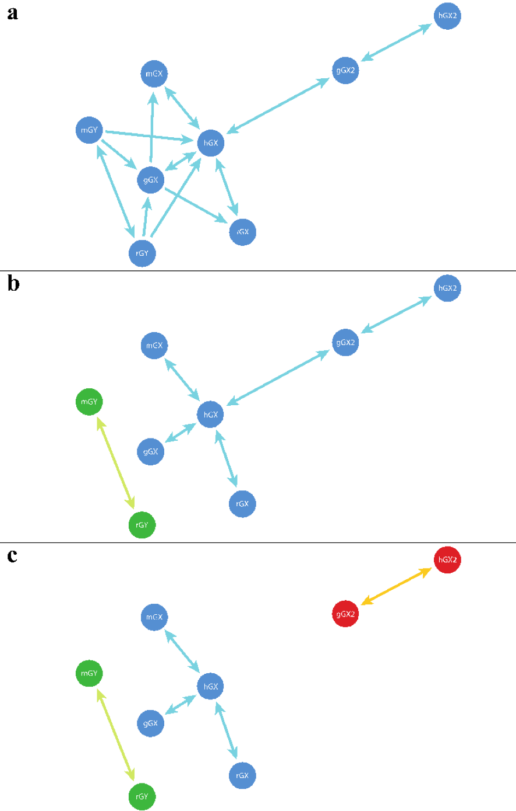

*************************
Phase 2: homology search
*************************

The second phase of VESPA is concerned with identifying groups of similar sequences from either BLAST [Altschul et al., 1990] or HMMER [Eddy, 1998] homology searches. Three types of sequence similarity are recognized by VESPA: non-reciprocal (unidirectional), reciprocal (bidirectional), and best-reciprocal. 'Non-reciprocal similarity' is characterized by sequence similarity that is only detected by one of the pair of sequences, commonly resultant of an E-value near the threshold. Non-reciprocal similarity is generally distantly related sequences. 'Reciprocal similarity' is similarity identified by both sequences in the pair. Reciprocal similarity is typically closely related orthologs or paralogs. “Best-reciprocal similarity” requires that the sequences pass two criteria: *(i)* they are sequences from different species, and *(ii)* in the pair-wise connection each sequence finds no other sequence in the respective species with a lower E-value. These requirements limit identification to orthologs (non-orthologs may be identified due to identical E-values or the absence of a true ortholog).  
Each type of similarity connection is invoked using a separate function and will generate the families specific to that connection type. Each function is required to be linked to a protein sequence database (see :ref:`create_database`). The database is used to produce an output file of each similarity group containing the protein sequences of each member. Each protein sequence files then undergoes multiple sequence alignment.

Core options
============

The :code:`-input` argument of each function within the second phase is designed to accept the modular output of BLAST and the standard output of HMMER (i.e. USR_HOMOLOGY). In addition, each function also requires both the :code:`database` and :code:`format` arguments. The :code:`database` argument is used to specify the protein sequence database created by earlier in the VESPA pipeline (i.e. ‘USR_DB’) (see :ref:`create_database`) whereas the :code:`-format` argument is used to specify the input format as either :code:`blast` or :code:`hmmer`. Please note that commands below are written on a single line.
::

    $ python vespa.py similarity_groups –input=USR_HOMOLOGY –format=blast –database=USR_DB

Each function also includes three optional threshold options that are disabled by default: :code:`e_value`, :code:`alignment_length`, and :code:`percent_identity`. The three options enable the user to define threshold values for the E-value, alignment length, and percentage identity of each homology connection. Enabled thresholds must be passed for a pair-wise homology connection to be used in creating similarity groups. If an E-value threshold is not enabled, each function is designed to only accept E-values < 1, otherwise warning message is printed.
::

    $ python vespa.py similarity_groups –input=USR_HOMOLOGY –format=blast -database=USR_DB -e_value=0.001
    $ python vespa.py similarity_groups –input=USR_HOMOLOGY –format=blast -database=USR_DB -alignment_length=75
    $ python vespa.py similarity_groups –input=USR_HOMOLOGY –format=blast -database=USR_DB -percent_identity=75

:code:`similarity_groups` and :code:`reciprocal_groups`
=======================================================

The ‘similarity_groups’ and ‘reciprocal_groups’ functions both construct sequence similarity groups using a similar approach. Both functions iteratively read a single line of input (BLAST or HMMER output) and record only the name of the query and subject if they pass enabled thresholds. Limiting the recorded data of the homology search to sequence names and their respective role (query or subject) results in reduced computational requirements, increased function speed, and permits the function to parse larger BLAST or HMMER input files. Both functions are able to recognize and record input that denotes reciprocal homology of a previously recorded entry. Once each function has completed processing the input, the pair-wise homologs are used to build families. The ‘similarity_groups’ function allows both non-reciprocal and reciprocal connections within a sequence group (:numref:`fig_similarity_groups`\a) whereas ‘reciprocal_groups’ is restricted to reciprocal connection within a sequence group (:numref:`fig_similarity_groups`\b).
::

    $ python vespa.py similarity_groups –input=USR_HOMOLOGY –format=blast -database=USR_DB
    $ python vespa.py reciprocal_groups –input=USR_HOMOLOGY –format=blast -database=USR_DB

.. note::

    Supported file format(s): ‘input’: BLAST tabular output format and HMMER standard output.

::

    # My scripts for this step
    # Concatenate the Blast output files
    cat *.txt.out > BlastOutput_AllAfr.txt.out

    # Make a similarity groups directory and copy the concatenated file there
    mkdir Similarity_GroupsAfr
    cp BlastOutput_AllAfr.txt.out Similarity_GroupsAfr/

    # Copy the database file from the Blastdb into the Similarity groups folder
    cp database_Afrotheria.fas ../Similarity_GroupsAfr/

    # Create a submission script in the scripts folder
    emacs similarity_groupsAfr.sh

    # Use previous script as a template, give the full 96 hours and 128 GB, specify the filenames and paths.

    #$ -cwd
    #$ -V
    #$ -l node_type=48core-3T
    #$ -l h_rt=96:00:00
    #$ -l h_vmem=128G
    #$ -m be
    #$ -M fbsisi@leeds.ac.uk                                                                                                                                	
    vespa.py similarity_groups -input=BlastOutput_AllAfr.txt.out -format=blast -database=database_Afrotheria.fas

    # Go to the Similarity groups folder, check that the Blast output file and database files are there. Then submit the job
    nohup qsub ../Scripts_Afrotheria/similarity_groupsAfr.sh &
    # Similarly for Reciprocal groups. Copy the similarity groups script, change the command form similarity_groups to reciprocal_groups and save. Then go to the Reciprocal_Groups folder and submit the job

Best-reciprocal similarity group (species-based) function
=========================================================

The :code:`best_reciprocal_groups` function constructs sequence homology groups by iteratively reading each line of input and storing the record within a database in reference to the query sequence. Once the function has completed parsing the input, the database is used to determine the best-homolog for each query sequence. This is achieved by identifying which subject sequence has the best E-value for each designated species. The designated best-hit for each query are then parsed to determine if the relationship is reciprocal (i.e. the subject sequence [as a query] identifies the query [as a subject]).  If a query and subject are identified as best-reciprocal homology hits, they are used to create families (:numref:`fig_similarity_groups`\c).
::

    $ python vespa.py best_reciprocal_groups –input=USR_HOMOLOGY –format=blast -database=USR_DB

.. note::

    Supported file format(s): ‘input’: BLAST tabular output format and HMMER standard output.

**Similarity groups created by functions**

.. _fig_similarity_groups:

    The families created using (a) ‘similarity_groups’, (b) ‘reciprocal_groups’, and (c) ‘best_reciprocal_groups’. Shorter lines represent better E-values between two sequences (circles). Lines with a single arrow represent non-reciprocal or unidirectional similarity connections. Lines with arrows on both sides represent reciprocal or bidirectional similarity connections. Sequence identifiers are shown for each sequence, different species are designated in this figure by lowercase letter at the beginning of each sequence identifier – h (human), m (mouse), r (rat), g (gorilla). (a) the ‘similarity_groups’ function connects all sequences as they are connected by either unidirectional or bidirectional similarity connections. (b) the ‘reciprocal_groups’ function creates two groups because the sequences mGY and rGY only exhibit a bidirectional similarity connection with each other.  (c) the ‘best_reciprocal_groups’ function creates a three groups as the gorilla GX2 (gGX2) exhibits a stronger (i.e. lower e-value) bidirectional similarity connection with human GX2 (hGX2)  than  human GX (hGX). 

Get SGOs
::

    # Python script for sorting all the similarity groups into single gene orthologs and paralogs. Save as GetSGO.py in the Scripts folder, 

    '''
    Give a list of files ending in .fasta will parse output with ENS ID headers and  
    copy single gene ortholog fams into a folder called SGO and others into a folder          called paralogs
    '''

    import glob, os
    import subprocess as unix
    try:
    	os.mkdir('./SGO/')
    except:
    	print("SGO folder already here")
    try:
    	os.mkdir('./paralogs/')
    except:
    	print("paralogs folder already here")
    for file in glob.glob('*.fasta'):
    	paraStatus=0
    	fileDict=dict()
    	with open(file, 'rU') as f:
        	for line in f:
            	if line.startswith('>'):
                	name=line.strip()
                	species=name.strip('>').split('|')[0][0:6]
                	if fileDict.has_key(species):
                    	unix.call(["cp", file, "./paralogs/"+file])
                    	paraStatus=1
                    	continue
                	else:
                    	fileDict[species]=species
            	else:
                	continue
    	if paraStatus==0:
        	unix.call(["cp", file, "./SGO/"+file])
    	else:
        	continue

::

    # Submission script saved as GetSGO.sh
    #$ -cwd                        	
    #$ -V                                  	
    #$ -l h_rt=48:00:00                             	
    #$ -l h_vmem=12G
    #$ -m be
    #$ -M fbsisi@leeds.ac.uk                                                                  

    python ../../Scripts_Afrotheria/GetSGO.py
    # Go to the folder that has all the similarity groups fasta files. And submit the .sh script that calls python and the .py script. 
    nohup qsub ../Scripts_Afrotheria/Get_SGOAfr.sh &

    # Creates 2 folders within the similarity groups folder - paralogs and SGO. 

    Sort SGOs to keep gene families with 7 or more members and remove uninformative gene families

    # Count the number of headers “>” there are in each similarity groups fasta file
    grep -c “>” *.fasta > GenecountsSGO.txt

    # Export this file to desktop, view in MSExcel and filter it to retain only the files that contain 7 or more members. Copy the list of gene families with less than 7 members, and then on the command line, move those files to a separate folder called “uninformative”. You can use a script, or simply the “mv” command. I just pasted the list into a text file, removed line breaks, and then used the ‘mv’ command.

