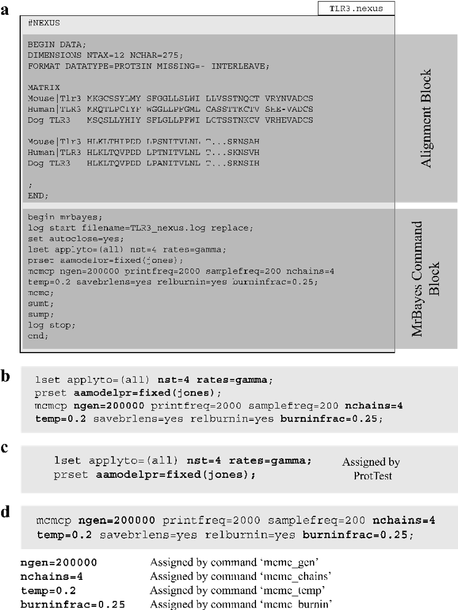

**********************************************************
Phase 3: alignment assessment and phylogeny reconstruction
**********************************************************

The third phase of VESPA combines multiple third-party programs (i.e. MetAl [Blackburne and Whelan, 2012] and NorMD [Thompson et al., 2001]) to automate the assessment and choice of protein Multiple Sequence Alignments (MSAs). In addition this phase enables simplified large-scale phylogenetic reconstruction. Alignment error is reported to cause high rates of false positives in a selective pressure analysis [Fletcher and Yang, 2010]. Therefore, VESPA incorporates third-party programs for MSA comparison and scoring. A complete analysis of the MSAs from each method is recommended. The next step in this phase is the selection of the empirical model of evolution that best-fits each MSA [Darriba et al., 2011; Keane et al., 2006]. The third phase concludes with an automated method for generating the files necessary for phylogenetic reconstruction using the previously selected MSA and model of evolution. The functions of this phase are primarily designed to interface with selected third-party programs. However, each step of this phase has been made optional if the user has other preferences or needs.

::

  # To do Muscle alignment, use the following script, saved as a muscle_script.sh file
  for i in *.fasta
  do
  muscle -in $i -out $i.mu
  done

  #$ -cwd                                                                    	
  #$ -V                                                                      	
  #$ -l h_rt=2:00:00

::

  # Run from inside the informative SGO fasta file folder, completes within seconds, maybe a couple of minutes. Check the output files once done, saved in the same folder with a .mu suffix. make a new directory - Muscle_Output. Move *.mu file into it.

  # For Mafft alignment, use the following script

  #$ -cwd                                                                     	
  #$ -V                                                                       	
  #$ -l node_type=48core-3T                                                   	
  #$ -l h_rt=48:00:00                                                                                                  	
  #$ -l h_vmem=32G                                                            	
  #$ -m be                                                                    	
  #$ -M fbsisi@leeds.ac.uk                                                    	
  #$ -o mafft.out                                                             	
  #$ -e mafft.err                                                             	

  mkdir Mafft_Output
  for i in *.fasta
  do
  mafft --auto --thread 2  $i > Mafft_Output/$i.mft
  done

  # Run from inside the SGO fasta file folder, completes within a couple of minutes. Check the output files once done, saved in the Mafft_Output folder created by the script. 

  # For Prank alignment, first we need to remove the pipe between the species common name and the gene ID and replace it with a space - in the gene headers. This is because Ali figured out that Prank does not recognise short names in gene headers that don’t have a space between the species common name and the gene ID. Or it uses the space to truncate the names. Even underscore doesn’t work. And if there is an underscore or |, running prank produces no outputs, but also no errors!!. 
  # So create a copy of all the .fasta files
  mkdir Prank_Input
  cp *.fasta Prank_Input
  cd Prank_Input

  # Use sed to replace the 1st pipe “|” in every header with a space
  sed -i ’s/|/ /‘ *.fasta

  # -i overwrites the .fasta files inside the Prank_Input folder. Leaving out the ‘g’ from the command makes sure the placement is not global. i.e., it will replace only the 1st instance in every line. So you get 
  >Tenrec XM_004699007.1
  MPSLSCRFYQHKFPEVEDVVMVNVRSIAEMGAYVSLLEYNNIEGMILLSELSRRRIRSIN
  KLIRIGRNECVVVIRVDKEKGYIDLSKRRVSPEEAIKCEDKFTKSKTVYSILRHVAEVLE
  YTKDEQLESLFQRTAWVFDDKYRRPGYGAYDAFKHAVSDPAILDSLDLNENERRVLIDNI
  NRRLTPQAVKIRAGIDAVKEALRAGLNCSTETMPIKINLIAPPRYVMTTTTLERTEGLSV
  LNQAMAVIKEKIEEKRGVFNVQMEPKVVTDTDETELARQLERLERENAEVDGDDDAEEME
  AKAED
  >Dolphin ENSTTRG00000015806|ENSTTRT00000015805
  MPGLSCRFYQHKFPEVDDVVMVNVRSIAEMGAYVSLLEYNNIEGMILLSELSRRRIRSIN
  KLIRIGRNECVVVIRVDKEKGYIDLSKRRVSPEEAIKCEDKFTKSKTVYSILRHVAEVLE
  YTKDEQLESLFQRTAWVFDDKYKRPGYGAYDAFKHAVSDPSILDGLDLNEDEREVLINNI
  NRRLTPQAVKIRAXXXXXXXXXXXXXXXXXXXXXXXXXXXXXXXXXINLIAPPRYVMTTT
  TLERTEGLSVLNQAMAVIKEKIEEKRGVFNVQMEPKVVTDTDETELARQLERLERENAEV
  DGDDDAEEMEAKAED
  >Macaque ENSMMUG00000021419|ENSMMUT00000030152
  MPGLSCRFYQHKFPEVEDVVMVNVRSIAEMGAYVSLLEYNNIEGMILLSELSRRRIRSIN
  KLIRIGRNECVVVIRVDKEKGYIDLSKRRVSPEEAIKCEDKFTKSKTVYSILRHVAEVLE
  YTKDEQLESLFQRTAWVFDDKYKRPGYGAYDAFKHAVSDPSILDSLDLNEDEREVLINNI
  NRRLTPQAVKIRADIEVACYGYEGIDAVKEALRAGLNCSTENMPIKINLIAPPRYVMTTT
  TLERTEGLSVLSQAMAVIKEKIEEKRGVFNVQMEPKVVTDTDETELARQMERLERENAEV
  DGDDDAEEMEAKAED

  # For Prank alignments using a guide tree, put a copy of the nested parentheses tree in the Prank_Input folder. It is very very important that the names used in the guide tree are identical to the ones used in the sequence files!! Then run the script 
  SAMPLES=*.fasta
  COMMANDS=()
  for S in $SAMPLES; do COMMANDS+=("prank -d=${S} -o=${S}.pk -t=19MammalsTree.txt -prunetree -shortnames -once -nobppa 2> prank_job.${SGE_TASK_ID}.std.err 1> prank_job.${SGE_TASK_ID}.std.out"); done
  #$ -cwd
  #$ -V
  #$ -l h_rt=48:00:00                                                                                                        #$ -l h_vmem=8G                                                                                                            #$ -t 1-426                                                                                                                #$ -tc 426                                                                                                                 #$ -o prank.out                                                                                                            #$ -e prank.err

  eval ${COMMANDS[$SGE_TASK_ID-1]}

  # Make sure the number in -t and -tc is the total number of .fasta files you will use as input - changes for similarity and reciprocal groups. Make sure the name of the guide tree is correct. I tried paying the whole text of the nested parentheses tree in the command - the help section of Prank says it should be possible. But didn’t work. I think the parentheses in the guide tree were confusing for the script. 
  # The whole run takes a few minutes. Make a Prank_Ouput directory in the SGO folder and move all the *.fas files from Prank_Input to Prank_Output.
  # For alignments without a guide tree, use the following script

  SAMPLES=*.fasta
  COMMANDS=()
  for S in $SAMPLES; do COMMANDS+=("prank -d=${S} -o=${S}.pk -prunetree -shortnames -nobppa 2> prank_job.${SGE_TASK_ID}.std.err 1> prank_job.${SGE_TASK_ID}.std.out"); done
  #$ -cwd
  #$ -V
  #$ -l h_rt=48:00:00                                                                                                        #$ -l h_vmem=8G                                                                                                            #$ -t 1-426                                                                                                                #$ -tc 426                                                                                                                 #$ -o prank.out                                                                                                            #$ -e prank.err                                                                                                                                                                                                 
  eval ${COMMANDS[$SGE_TASK_ID-1]}
  
  # Put all the output files into a folder Prank_Output_notree in the SGO folder.
  # Prank outputs have short names, need to add the gene ID headers again, use Ray's python script (vespa_ChangeNamesToOriginalLongFormat.py)
  import glob
  for file in glob.glob('*.fasta'):
    #make map
    with open(file, 'r') as f1:
    longSpNames={}
    for line1 in f1:
    if line1.startswith(">"):
    spName=line1.strip().split(" ")[0]
    longSpNames[spName]=line1.strip()
    else:
    continue
    shortAli_name=file+".pk.best.fas"
    newName=shortAli_name+".longNames"
    with open(shortAli_name, 'r') as shortAli, open(newName, 'w') as f2:
    for line2 in shortAli:
    if line2.startswith(">"):
    oriName=longSpNames[line2.strip()]+'\n'
    f2.write(oriName.replace(" ", "|"))
    else:
    f2.write(line2)
   
  # Copy the original similarity_group_*.fasta files into the Prank Output folder. Then run python vespa_ChangeNamesToOriginalLongFormat.py in the folder where all of these files are, you should get all the files written with the extension "*.longNames"
  # CodeML cannot take headers that are longer than 30 character. To shorten the Ensembl headers to 30 characters or less (needed by CodeML) - remove the transcript ID
  sed -ic '/|ENS/s/...................$//' similarity_group_0028.fasta.mu
  # Finds the pattern |ENS, and in that line, substitutes the last 19 characters with nothing. -ic means it modifies the files and makes a backup copy of the original file. I found NCBI gene ID headers to be smaller than 30 characters (once the gene description was removed) so there was no need to shorten those again.

Alignment comparison function
=============================

The :code:`metal_compare` function is designed to fully automate MSA comparison and scoring. The function operates using the third-party program MetAl [Blackburne and Whelan, 2012] to compare two protein MSAs. If MetAl indicates that the two MSAs are dissimilar, the function employs the third-party program NorMD [Thompson et al., 2001] to score each protein MSA using column-based similarity. The MSA with the highest NorMD (i.e. column-based similarity) score is then selected for subsequent analysis. It should be noted that the :code:`metal_compare` function requires the option :code:`-compare` to operate.
::

  $ python vespa.py metal_compare –input=USR_INPUT -compare=USR_INPUT

Command-specific options: The :code:`metal_compare` function incorporates one additional option (:code:`-metal_cutoff`) that may be configured by the user. The :code:`-metal_cutoff` option assigns the numeric threshold determining MSA dissimilarity and by default is fixed at 5%. Alignment methods that yield MetAl scores lower than defined value are considered comparable and the function will select the MSA from the first alignment method (indicated using the :code:`-input` option).
::

  $ python vespa.py metal_compare –input=USR_INPUT -compare=USR_INPUT - metal_cutoff=0.10
.. note::
  Supported file format(s): :code:`-input` and :code:`-compare`: fasta formatted files (nexus to be added in a future release).

.. note::
  Vespa metAl works if you make sure headers are identical between all the different alignments. (reintroduce long gene ID headers into the Prank alignments). But not for MAFFT – somehow it doesn’t recognize the Mafft alignment. Tried Mafft single line fasta file as well, didn't work. Does not recognize the input format as an alignment
::

  python vespa.py metal_compare -input=Prank_Output_Longnames/ -compare=Muscle_Output/

Empirical model selection functions
===================================

The :code:`prottest_setup` function: This function is designed to automate the process of identifying the best-fit model of amino acid replacement for a specified protein alignment using the third-party program ProtTest3 [Darriba et al., 2011]. The function is designed to test each amino acid substitution model in both the absence and presence of invariant sites, gamma categories, and a combination of the two.
::

  $ python vespa.py prottest_setup –input=USR_INPUT
.. note::
  Supported file format(s): :code:`-input` fasta formatted files (nexus to be added in a future release).
The :code:`prottest_reader` function: This function automates the process of reading the output of ProtTest3. The function creates two output files: best_models.csv and best_supported_models.csv. The best models file reports the best-fit model of amino acid replacement (± rate-heterogeneity) reported by ProtTest3 whereas the best supported file reports the best-fit model of amino acid replacement (± rate-heterogeneity) supported by the third-party phylogenetic reconstruction program MrBayes [Ronquist and Huelsenbeck, 2003]. The two output files are given to enable the user to use different phylogenetic reconstruction software if desired.
::

  usr$ python vespa.py prottest_reader –input=USR_INPUT
.. note::
  Supported file format(s): :code:`-input`: prottest3 standard output format.

:code:`mrbayes_setup`
=====================

The :code:`mrbayes_setup` function (:numref:`fig_mrbayes_setup`) is designed to simplify the process of phylogenetic reconstruction using the third-party program MrBayes [Ronquist and Huelsenbeck, 2003]. The function begins by converting each protein MSA into the nexus format (:numref:`fig_mrbayes_setup`\a). Each nexus-formatted MSA is then appended with a standardized MrBayes command block that defines the variables required for phylogenetic reconstruction (:numref:`fig_mrbayes_setup`\b-d), they include the number of MCMC generations, the number of chains (trees) to be examined per generation, the temperature of the heated chain, the burn-in percentage, and the best-fit model of amino acid replacement (see :ref:`Empirical model selection functions`). Please note that the :code:`mrbayes_setup` function requires the option :code:`-model_list` to operate. The :code:`model_list` option is used to target the 'best_supported_models.csv' output file generated by the :code:`protest_reader` function (see :ref:`Empirical model selection functions`).
::

  $ python vespa.py mrbayes_setup –input=USR_INPUT –model_list=MODEL_DATA
.. note::
  Supported file format(s): :code:`input`: fasta formatted files (nexus and phylip formats to be added in a future release).
Command-specific options: The :code:`mrbayes_setup` function incorporates multiple options (:code:`-mcmc_gen`, :code:`-mcmc_chains`, :code:`-mcmc_temp`, :code:`-mcmc_burnin`) for permitting the user to alter variables within the MrBayes command block (:numref:`fig_mrbayes_setup`\b-d). The :code:`mcmc_gen` option sets the number of generations for the phylogenetic reconstruction and should be increased from the default value of 200,000 if previous attempts failed to converge. The remaining options have the following recommended settings by default: :code:`mcmc_chains` i.e. the number of chains (default = 4), :code:`mcmc_temp` i.e. the temperature of the heated chain (default = 0.2), and :code:`mcmc_burnin`, i.e. the burn-in percentage respectfully (default = 0.25).
::
  $ python vespa.py mrbayes_setup –input=USR_INPUT –model_list=MODEL_DATA -mcmc_gen=100000
  $ python vespa.py mrbayes_setup –input=USR_INPUT –model_list=MODEL_DATA -mcmc_chains=6
  $ python vespa.py mrbayes_setup –input=USR_INPUT –model_list=MODEL_DATA -mcmc_temp=0.3
  $ python vespa.py mrbayes_setup –input=USR_INPUT –model_list=MODEL_DATA -mcmc_burnin=0.3

Overview of :code:`mrbayes_setup`.

.. _fig_mrbayes_setup:

The MrBayes input file is described as follows: (a) The NEXUS file is separated into two blocks, a sequence alignment block and a MrBayes command block. (b) The specific commands within the MrBayes command block are each assigned default values (in bold) based on recommend values and previous commands. (c) The commands lset and prset by default are automatically assigned by VESPA from the :code:`best_supported_models.csv` file (see :ref:`Empirical model selection functions`) specified by the :code:`model_list` option. (d) The remaining commands are assigned based on recommended values, but may configured by the user is desired.

