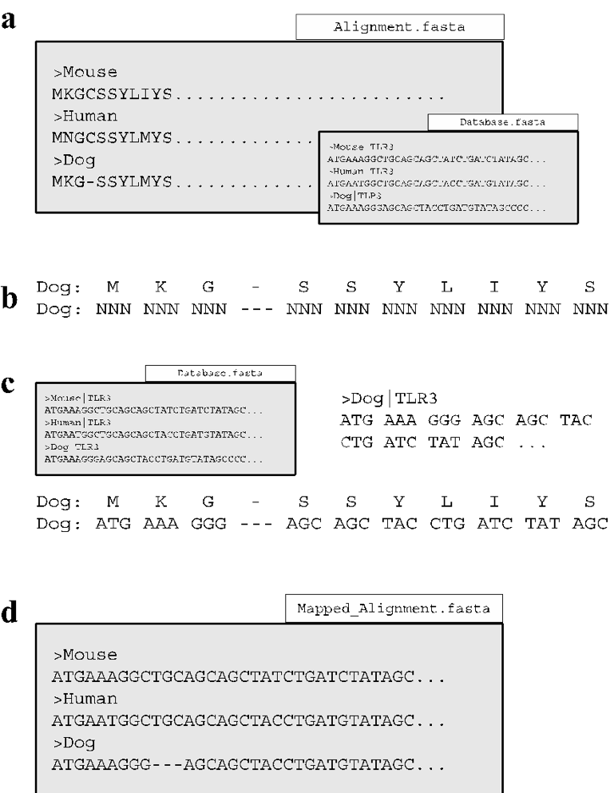
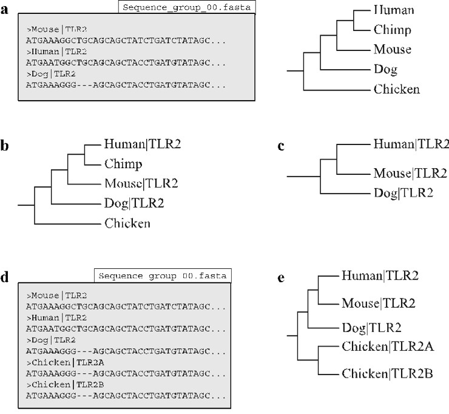
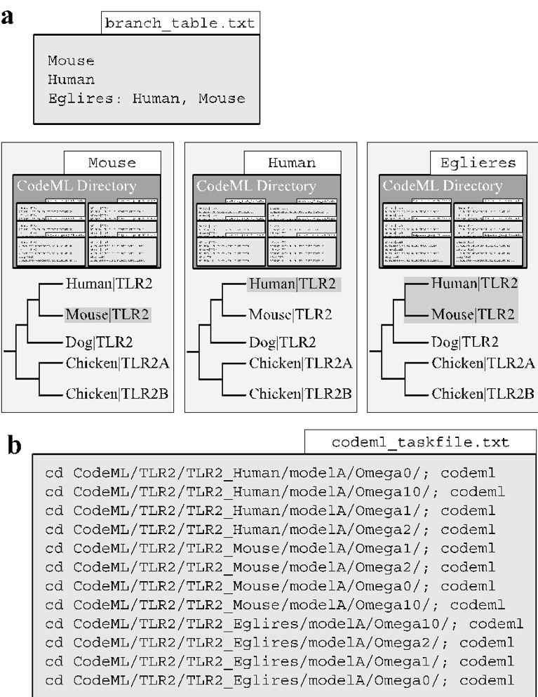
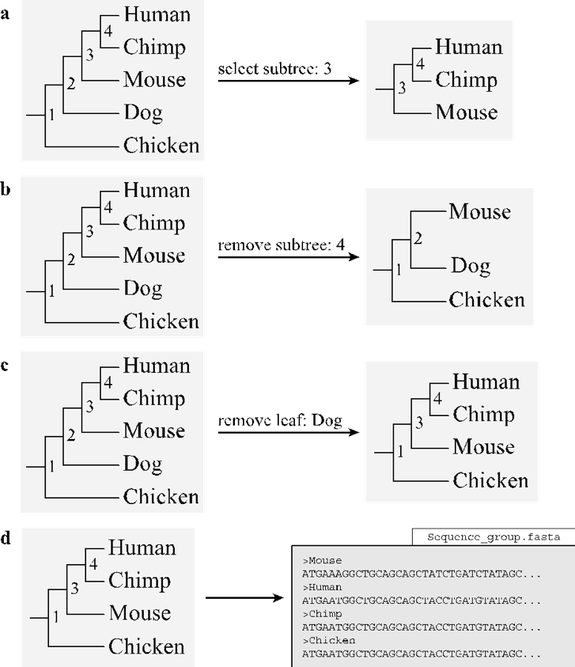

***************************************
Phase 4: selection analysis preparation
***************************************

The fourth phase of VESPA automates large-scale selective pressure analysis using codeML from the PAML package [Yang, 2007]. Phase four is characterized by specific commands for the basic and advanced pipeline options (:numref:`fig_overview`). These pipeline-associated functions are designed to process the specific input of each pipeline into a standardized file format for the common functions used by both pipelines. Following standardization, VESPA automates the normally labor-intensive process of creating the necessary files and directory structures for codeML. Phase four also incorporates a single optional function :code:`branch-label table` (see :ref:`create_branch`) that may be invoked to enable the branch-site models of codeML [Yang, 2007].

Alignment mapping function
==========================

The :code:`map_alignments` function is designed to automate the conversion of protein MSAs to nucleotide MSAs (:numref:`fig_map_alignments`). This process is mandatory as the codon substitution models of codeML require nucleotide alignments. Protein-MSA guided nucleotide MSAs are generated rather than directly generating nucleotide MSAs because: i) each column within the protein MSA represents aligned codons and therefore avoids aligning incomplete codons or frame-shift mutations, and ii) protein MSAs represent a comparison of the phenotype-producing elements of protein-coding sequences (:numref:`fig_map_alignments`\a). The function begins by reading the protein MSA to map the non-gap position of each codon within the inferred nucleotide alignment (:numref:`fig_map_alignments`\b). The sequence of the mapped codons is then inferred using the nucleotide dataset (preferably as a database) from earlier in the pipeline (:numref:`fig_map_alignments`\c). If the mapping process results in no errors, the respective nucleotide MSA is created (:numref:`fig_map_alignments`\d). All errors detected by the function will be returned within a separate log file. Please note that the :code:`map_alignments` function requires the option :code:`-database` to indicate the nucleotide dataset for correct sequence inference.
::

	$ python vespa.py map_alignments –input=USR_INPUT –database=USR_DB
.. note::
	Supported file format(s): :code:`-input`: fasta formatted files (nexus and phylip formats to be added in a future release); :code:`-database`: fasta formatted files.

**Overview of the** :code:`map_alignments` **function**

.. _fig_map_alignments:

	Sequence files are shown above as grey boxes indicating the sequences and white boxes indicating the filename. The 'map_alignments' function requires (a) two files to operate: a protein alignment (Alignment.fasta) and a nucleotide sequence database (Database.fasta). The function initiates by (b) mapping the gaps of the nucleotide alignment. (c) The nucleotide sequence of each alignment is then mapped using the sequence database to produce (d) the completely mapped output file.

Gene tree inference function
============================

The :code:`-infer_genetree` function is designed to automate the creation of the corresponding gene tree for a user-specified MSA. This is achieved by associating the taxa specified on a user-defined species tree with the headers created by 'label_filename' and :code:`infer_ensembl_species` (see :ref:`clean and clean_ensembl functions`) within the MSA. The function operates by first creating a copy of the species tree with the species names (:numref:`fig_infer_genetree`). The species tree is designated using the required :code:`species_tree` option.The species names are then replaced with their associated MSA headers (:numref:`fig_infer_genetree`\b). If any species names remain after this phase, the taxa and their respective branches are removed from the tree to create the finished gene tree (:numref:`fig_infer_genetree`\c). It should be noted that the :code:`infer_genetree` function incorporates the non-standard python library dendropy [Sukumaran et al., 2010], Further details can be found at :ref:`Third party software`.
::

	$ python vespa.py infer_genetree –input=USR_INPUT –species_tree=USR_INPUT
.. note::
	Command-specific options: The :code:`infer_genetree` function incorporates a single option :code:`-allow_paralogs` that is disabled by default. Normally, :code:`infer_genetree` is designed to only allow a single MSA header to associate with a species name (:numref:`fig_infer_genetree`\d). If multiple headers are found to associate with a species name, VESPA will produce a warning message. The :code:`-allow_paralogs` may be enabled in these situations if the association error(s) are caused by within-species paralogs, in this case a gene tree will be created with associated headers shown as within-species paralogs (:numref:`fig_infer_genetree`\e).
::

	$ python vespa.py infer_genetree –input=USR_INPUT –species_tree=USR_INPUT -allow_paralogs=True
.. note::
	Supported file format(s): 'input': fasta formatted files (nexus and phylip formats to be added in a future release); 'species_tree: newick formatted files (nexus tree format to be added in a future release)

**Overview of the** :code:`infer_genetree` **function**

.. _fig_infer_genetree:

	The goal here is to determine the phylogenetic relationship of the sequences within the alignment in relation to the species phylogeny. (a) The 'infer_genetree' function requires two files to operate: a nucleotide alignment (Sequence_group_00.fasta) and a species phylogeny (b) The function begins by replacing each species name within the phylogeny with their respective gene identifier (i.e. Human → Human|TLR2) located in the nucleotide alignment. (c) The function then creates the gene phylogeny by removing the species that have not been replaced by a gene identifier. (d) If the nucleotide alignment specified by the user contains paralogs (Chicken TLR2A and TLR2B) VESPA will produce an error message. (e) If the 'allow_paralogs' option is enabled the function will create a new branch to house the paralogs with the original species acting as an ancestral node. 

:code:`codeml_setup` function
=====================

The :code:`codeml_setup` function is designed to simplify the creation of the complex codeML directory structure. This is achieved by incorporating previously written in-house software :code:`GenerateCodemlWorkspace.pl` written by Dr. Thomas Walsh to produce the codeML directory structure [Walsh, 2013]. The purpose of automating the program :code:`GenerateCodemlWorkspace.pl` via :code:`setup_codeml` was to simplify input requirements and enable high-throughput analyses. The function requires only a protein-inferred nucleotide MSA (see :ref:`Alignment mapping function`) and an associated phylogenetic tree (See :ref:`Gene tree inference function` or :ref:`MrBayes reader function`) to construct the directory structure for the CodeML site-specific models [Walsh, 2013]. 
::

	$ python vespa.py codeml_setup –input=USR_INPUT
.. note::
	Supported file format(s): :code:`input`: newick formatted files (nexus tree format to be added in a future release)
Command-specific options: If the user has created the optional branch-label table (see :ref:`create_branch`) and enabled the :code:`-label_table` option the function will create the directory structure for the codeML branch-site models. Automating the branch-site models requires a specific directory for each species and/or lineage specified by the user in the optional branch-label table (:numref:`fig_codeml_setup`\a). Next the :code:`setup_codeml` function will produce a codeML :code:`taskfile` that contains each codeML command line command to be computed (:numref:`fig_codeml_setup`\b). Following creation of the taskfile, a separate log file reporting the branch-site models that cannot be tested (due to missing taxa) is produced.
::

	$ python vespa.py codeml_setup –input=USR_INPUT –label_table=USR_INPUT

Overview of the 'codeml_setup' function.

.. _fig_codeml_setup:

	(a) Using the branch-label table (branch_table.txt) the function produces species-labelled (highlighted) phylogenies for each species or ancestral node specified and then automates the production of the codeML directory for the branch-site models. (b) The function terminates by producing a CodeML taskfile with all the codeML command line commands required to complete the job.

MrBayes reader function
=======================

If phylogenetic reconstruction has been performed by MrBayes then the 'mrbayes_reader' function is designed to replace 'infer_genetree' [Ronquist and Huelsenbeck, 2003]. The function operates by converting the nexus-formatted phylogeny into the newick format supported by VESPA and codeML [Yang 2007]. If the function is unable to locate the original amino acid fasta-formatted MSA required by :ref:`mrbayes_setup` the nexus-formatted MSA will be converted and placed with the newick-formatted phylogeny. It should be noted that 'mrbayes_reader' is unable to check phylogenies for convergence. Instead users are directed to confirm convergence using third party software such as Tracer [Rambaut et al., 2014].
::

	$ python vespa.py mrbayes_reader –input=USR_INPUT
.. note::	Supported file format(s): :code:`-input` MrBayes standard output format.

Subtree function
================

The :code:`create_subtrees` function is designed for high-throughput tree pruning. This optional step is often required to prune very large multigene family phylogenies into smaller sub-phylogenies. Larger phylogenies may require this pruning step due to feasibility concerns and as subfamilies decrease computational requirements whilst making data easier to manage we have included this optional function. Users may require this option for pruning out SGOs for selection analyses that are focused on single genes. The function operates by displaying the current phylogeny with a set of pruning commands/options. The user is then prompted to select one of the four commands: 'select subtree', 'remove subtree', 'remove leaf', or 'keep original'. If either 'select subtree' or 'remove subtree' is selected, the user is prompted to select a single node (numbered on the displayed phylogeny) for selection or removal respectively (:numref:`fig_create_subtrees`\a-b). If 'remove leaf' is selected, the user is prompted to select a leaf label (sequence header) for removal (:numref:`fig_create_subtrees`\c). If 'keep original' is selected the tree manipulation step is skipped. The 'create_subtrees' function will produce a protein sequence file of the remaining nodes in the phylogeny (:numref:`fig_create_subtrees`\d). The protein sequence file is then required to undergo re-alignment and it proceeds from Phase 3 through the remainder of the pipeline (:numref:`fig_overview`). The 'create_subtrees' function will also produce a separate log file of the original phylogeny, the selected command, and the resulting phylogeny. The 'create_subtrees' function incorporates the non-standard python library dendropy [Sukumaran et al., 2010] (see :ref:`CodeML results assessment`).
::

	usr$ python vespa.py create_subtree –input=USR_INPUT
.. note::
	Supported file format(s): 'input': newick formatted files (nexus tree format to be added in version 0.3β)

**Overview of** :code:`create_subtrees` **function**

.. _fig_create_subtrees:

	An example of the node-labelled phylogeny displayed for the user is shown on the left for each of the options (a-c). (a) If the user specifies the 'select subtree' option along with a node, the function creates the subtree by dissociating the specified node from its ancestral node and returning the requested subtree. (b) The 'remove subtree' options functions similarly to 'select subtree' except that requested subtree is discarded and the subtree containing the remaining leaves is returned. (c) The 'remove leaf' option will remove the specified taxa from the phylogeny. (d) The function terminates by creating sequence files for each pruned phylogeny.

:code:`create_branch`
=====================

The :code:`create_branch` function is designed to simplify the creation of the branch-label table required for the branch-site models of codeML [Yang 2007]. The branch-label table (previously shown in :numref:`fig_codeml_setup`\a) indicates the lineages or 'branches' that will undergo lineage-specific selection analysis, i.e. designation of the 'foreground lineages' for codeML. Each line indicates one lineage, either a species or an ancestral node. Ancestral nodes (uniquely named by user [i.e. Eglires]) are followed by a list of descendant (extant) species (:numref:`fig_codeml_setup`\a). The function operates by displaying a user-specified species phylogeny and promoting the user to select the species and/or ancestral nodes (numbered on the displayed phylogeny) of interest for the study (identical display methodology as described in :ref:`MrBayes reader function` - see phylogeny in :numref:`fig_create_subtrees` for example). When the user has finished their selection, the function will automatically produce the branch-label table. It should be noted that this function is completely optional as the branch-label table may be easily created by hand. The 'create_branch' function incorporates the non-standard python library dendropy [Sukumaran et al., 2010] (see :ref:`CodeML results assessment`).
::

	$ python vespa.py create_branch –input=USR_INPUT
.. note::
	Supported file format(s): 'input': newick formatted files (nexus tree format to be added in a future release)

