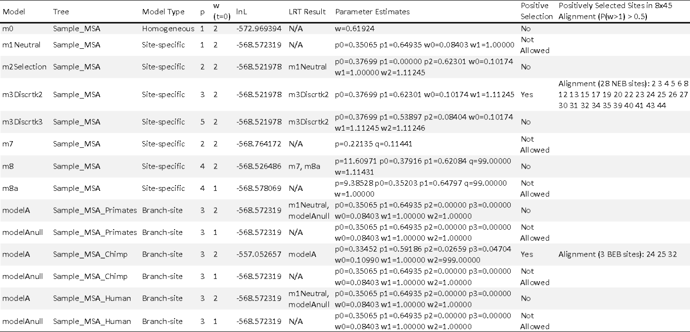

**************************************
Phase 5: selection analysis assessment
**************************************

CodeML results assessment
=========================

The :code:`codeml_reader` function is designed to parse the complex CodeML directory structure and create simplified results for inexperienced users. This is achieved by incorporating in-house software :code:`CreateSummaryReport.pl` written by Dr. Thomas Walsh [Walsh, 2013] to produce the majority of the codeML results. In addition to automating :code:`CreateSummaryReport.pl`, :code:`codeml_reader` produces supplementary output files (:numref:`fig_codeml_reader`) and specialized MSAs that are designed to aid in the detection of false positives (:numref:`fig_codeml_reader_special`). If the user specifies a branch-label table (see :ref:`create_branch`) :code:`codeml_reader` will produce CodeML MSAs, these MSAs are characterized by the addition of *i)* the putative positively selected sites, and *ii)* the codons/amino acids that are positively selected in the respective lineage(s).
::

	$ python vespa.py codeml_reader –input=USR_INPUT

.. note::

	Supported file format(s): :code:`-input`: VESPA formatted codeML standard output.

**Sample supplementary output file created by** :code:`codeml_reader`

.. _fig_codeml_reader:

	The supplementary output file includes information for each site-specific and branch-specific model of codeML. The following information is provided for each model: the tree tested; the type of model (i.e. site-specific or branch-specific) being tested; number of free parameters in the ω distribution that are estimated by codeML, the initial ω value used by codeML; the resulting log likelihood (lnL) of the analysis; the resulting model of the likelihood ratio test (LRT); the parameter estimates of codeML; if positive selection was detected; and the positively selected sites (if positive selection was detected).

**Sample specialized MSA created by** :code:`codeml_reader`

.. _fig_codeml_reader_special:

	The specialized MSA shown above includes data on the location of positively selected codons or residues. Depending on the type of model being explored, the MSA will include additional information. For all models (site-specific or branch-specific), the header :code:`PS_Sites` indicates the position of the positively selected codons (shown as NNN) or residues (shown as X). For branch-specific, the characters under positive selection are shown for each relevant lineage using the header :code:`PS_Characters` followed the by the lineage of interest (i.e. :code:`PS_Characters|Chimp above`).

